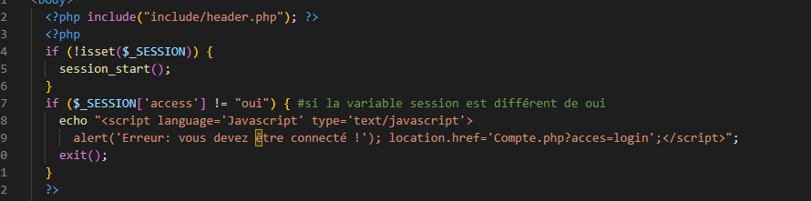

:toc:
:toc-placement!:
:toc-title: Table des matières

image::images/Logo.png[]

= Site Cheribou - Documentation Technique 
_Réalisé par Anthony Cabrillac, Victor Thompson, Yann Guillevic, Léo Douville, Shiyu Hu

toc::[]

== I - Présentation rapide du site
L’entreprise Cheribou souhaitant re-conceptualiser son site internet pour que celui-ci soit le plus attractif possible afin d’augmenter le nombre de clients inscrits et d’améliorer le nombre de ventes en ligne. De plus, Cheribou a la volonté et les ressources pour se développer à l'international afin degagner en notoriété et en visibilité. Cheribou cherche à s’introduire et à s’exporter sur les marchés Allemand et Américain. Mais le site internet actuel est désuet et n’est pas adapté à pour une future expansion internationale. Une version anglaise du site devra donc être créée afin de s’adapter au nouveau type de clients. Le nouveau site web devra être adapté pour des enfants, adolescents et jeunes adultes, être simple à parcourir et être sécurisé pour permettre une bonne utilisation du site web et une fidélisation de la clientèle.

=== 1. Explications du use case global

Voici le use case général du nouveau site de cheribou:

_mettre SEP_

==== 1.1 Types d'utilisateurs et spécificités

Il y a trois types d'utilisateurs qui subsistent : l'administrateur, les clients ainsi que les visiteurs.

Premièrement, un visiteur aura accès au site pour simplement y découvrir les produits en vente chez Cheribou. Celui-ci aura accès :

- A la page principale.
- A la page sur l'entreprise.
- A la page des nouveautés.
- A la page des offres.
- A la page de création/connexion à un compte.
- A la page de contact.
- Aux différents bonbons ainsi qu'a leurs descriptifs.
- Aux différents récipients ainsi qu'a leurs descriptifs.

Un visiteur pourra également utiliser la barre de recherche pour rechercher des produits.

Deuxièmement, un client aura accès aux mêmes spécifités qu'au visiteur avec en plus l'accès à :

- La page panier.
- La page descriptive d'un compte.
- La page de paiement.

Un client pourra également modifier les informations de sont compte, voir et payer avec ses points de fidélités, voir ses commandes.

Troisèmement, un administrateur aura accès à un espace sécurié parallèlement au site. Il aura donc la possibilité d'effectuer des actions exclusivement réservées à un administrateur. Un visiteur ou un client n'y ont donc pas accès.

L'administrateur pourra donc :

- Rajouter du stock pour bonbon
- Rajouter du stock pour récipient
- Ajouter/supprimer des nouveaux produits(bonbons,récipients).
- Ajouter de nouvelles catégories.
- Voir les commandes passées par les clients.

== II - Architecture

=== 1. Architecture générale

Pour les visiteurs ou clients le site est simple d'utilisation, reste relativement facile à comprendre et respecte la règle des trois clics.

==== 1.2 Serveurs
Le site est héberger sur un serveur Apache deployé dans un serveur de l'IUT de Blagnac.

Le site possède une base de données propre à ses caractéristiques. Elle permet de conserver l'ensemble des informations relatives au clients et produits telles que : +
____
• Les clients ; 
• Les produits ; 
• Les promotions ;
• Les commandes ;
• Les paniers des clients ;
____

=== 2. Ressources externes et rôles

=== 3. Structuration en packages de l'application

La structuration du site est répartie en plusieurs packages que voici : 

[source]
----
├── public_html
	├── admin.php
	├── AjoutPanierBonbon.php
        ├── AjoutPanierRecip.php
	├── bonbon.php
	├── Boutique.php
	├── Cadeaux.php
	├── ChangerMDP.php
	├── choixP.php
	├── Compte.php
	├── contact.php
	├── detailBonbon.php
	├── detailRecipient.php
	├── index.php
	├── InfosCompte.php
	├── Nouveaute.php
	├── panier.php
	├── produitadmin.php
	├── Promotion.php
	├── recipient.php
        └──include
         	  ├── actionContact.php
		  ├── actionPanierCadeau.php
		  ├── actionRecherche.php
		  ├── admin.css
		  ├── adminCo.css
           	  ├── bonbon.css
           	  ├── Boutique.css
		  ├── contact.css
		  ├── Cadeau.css
	   	  ├── choixP.css
	   	  ├── Compte.css
		  ├── Connect.inc.php
		  ├── contact.css
		  ├── Deconnexion.php
	   	  ├── datailBonbon.css
	   	  ├── detailRecipient.css
	   	  ├── footer.css
		  ├── footer.php
	   	  ├── header.css
		  ├── header.php
	   	  ├── headeradmin.css
		  ├── headeradmin.php
		  ├── index.css
		  ├── infosCompte.css
	   	  ├── modifierCompte.php
		  ├── Nouveaute.css
		  ├── Panier.css
		  ├── proadmin.css
		  ├── Promotion.css
		  ├── recipient.css
		  ├── stockadmin.php
		  ├── stockadminrecip.php
	   	  ├── suppbonbonadmin.php
	   	  ├── supprecipadmin.php
	   	  ├── supprimerbonbon.php
	   	  ├── supprimerRecipient.php
		  ├── traitAdminCo.php
	   	  ├── traitFormConnexion.php
	   	  ├── traitFormCreerCompte.php
		  ├── traitFormPaiement.php
	   	  ├── traitNvBonbon.php
		  ├── traitNvCategorie.php
		  ├── traitNvRecip.php
		  ├── traitPanier.php
		  └──Images
    			├── imgBonbons
			├── ...

----
Cette arborescence a été choisi par les membres de l'equipes pour la facilité de compréhension qu'elle apporte.

=== 4. Éléments à connaître

Comme vous pouvez l'observer, le code de du site est fourni dans 1 package principal étant ``public.html`` et dont celui-ci contient les pages principales .
Vous pouvez observez que les fichier n'ont pas toute la meme extension: +

____
• php ; 
• css; 
____

==== 4.1 Spécificités

Concernant le type ``php``, celui-ci est utiliser pour mettre les éléments et les rendre dynamique avec la base de données. 

Le type ``css`` est utilisé pour la mise en forme des éléments en ajoutant ou modifiant un style  d'un élément. Chaque page php sa propre page css pour la mettre en page

==== 4.2 Éléments nécessaires à la mise en oeuvre du développement

Par la suite, il lui est nécessaire de posséder un IDE (environnement de développement intégré) pour tout simplement pouvoir observer le code et interagir avec. Visual Studio Code ou encore SublimeText sont des IDE que le développeur peut utiliser. 

== III - Explications des fonctionnalités

*Header*

Le header est commun à chaque page pour un client et un visiteur.

Celui-ci contient le logo de l'entreprise ainsi que le nom de celle-ci et la langue du site, en haut à droite.
Au centre, une barre de recherche permet de rechercher des bonbons. Cette recherche redirige l'utilisateur vers la page ``bonbon.php`` qui affiche les bonbons.

A gauche, le label _Notre entreprise_ redirige l'utilisateur vers la page sur l'entreprise : ``Boutique.php``.
A droite, le logo avec le bonhome est un lien cliquable qui redirige l'utilisateur vers ``Compte.php`` s'il n'est pas connecté et sur ``InfosCompte.php`` s'il est connecté.

Le menu _bonbon_ permet de parcourir les différents types de bonbons en les choisissant par marque, format, goût ou préférence alimentaire. Chacun de ces liens renvoie vers la page ``bonbon.php`` qui affiche les bonbons en fonction des choix fait par l'utilisateur.

image::images/menus.png[menus]

Le label _Nouveauté_ renvoie l'utilisateur vers la page ``Nouveaute.php`` où il pourra y trouver les nouveaux produits.   

Le label _Offres_ renvoie l'utilisateur vers la page ``Promotion.php`` où il pourra y trouver les offres en cours sur certains produits.  

Le label _Récipients_ renvoie l'utilisateur vers la page ``recipient.php`` où il pourra y trouver tous les récipients en vente.           

*Footer*

Le footer est commun à chaque page pour un client et un visiteur.

Celui-ci contient plusieurs liens ramenant vers la page principale; ``index.php``, ainsi que la page sur l'entreprise; ``Boutique.php``, la page des nouveaux produits; ``Nouveaute.php`` et la page de contact; ``contact.php``.       

=== 1 Visiteur

==== 1.1 Accès à la page principale

Lorsqu'un visiteur ou client arrive sur le site, celui-ci est dirigé vers la page principale composé du header, footer ainsi que de 3 images principales correspondant aux 3 nouveaux produits du moment.

image::images/index.PNG[index]

==== 1.2 Accès aux comptes client

===== 1.2.1 Création d'un compte
Le visiteur aura la possibilité de créer son compte via un formulaire sur la page "compte.php".

image::images/traitformcreercompte.png[3.2]

Ce formulaire est ensuite envoyé à la page "traitFormCreerCompte.php"

image::images/traitformcreercompte.png[0]

Cette page verifie d'abord si les champs sont remplis.
Pas besoin de faire de regex sur les adresses mail car le type mail le fait automatiquement.

Si ces champs sont remplis : +
____
• include le fichier qui permet de se connecter a la base de données; 
• Verifie si l'addresse mail est unique. ; 
____

Si l'adresse mail n'est pas bonne, une alerte s'affiche et nous redirige vers la page de creation.

Si l'adresse est unique:+
____
• Verifie si le mot de passe et la comfirmation de mot de passe sont identique.; 
• Verifie si l'addresse mail et la comfirmation d'email sont identique. ; 
____

Si l'un des deux n'est pas verifié ou les deux, une alerte s'affiche avec les champs où il y avait des erreurs en nous redirigeant vers la page de creation d'un compte.
 

image::images/traitformcreercompte3_2.png[3.2]

Si les champs sont identiques, crypte le mot de passe avec la fonction "password_hash()" et insert le nouveau compte dans la base de données avec les données saisies.

===== 1.2.2 Connexion à un comtpe
Pour la connexion a un compte, cela se fait via au formulaire de la page Compte.php et est traiter sur la  page "traitFormConnexion.php".

Si les champs sont bien remplis et que le couple mail/mot de passe est corecte, alors on lance la requête SQL permettant de récupérer les informations du client connecté et on affecte les données nécessaire dans des sessions pour utilisation ultérieure.

Gestion des erreurs :

Si le mot de passe est incorecte:
____
• On lance une erreur javascript pour le mot de passe et on redirige vers la page de connexion

____

Si le couple mot de passe et email est incorecte:
____
• On lance une erreur javascript pour le mot de passe et l'adresse mail et on redirige vers la page de connexion

____

Si il n'y a pas tous les champs de remplis ou si il manque l'acceptation des conditions d'utilisations:
____
• On lance une erreur javascript pour le remplissage des champs et on redirige vers la page de connexion

____

===Spécidication de code
Comme vous avez pu le constater la connexion et de creation d'un compte  se font tous sur la meme page, "Compte.php" ceci est fait grace un lien qui rappel la page avec une valeur envoyer dans l'URL avec le  nom "acces" si il est égale à login alors le formulaire de connexion s'affiche s'il est égale a register alors la page affiche le formulaire de création d'un compte.

==== 1.3 Accès à la page de l'entreprise

La page sur l'entreprise permet à un visiteur/client d'en apprendre plus sur Cheribou en ayant accès à son hsitoire. Les internautes ont également accès à plusieurs chiffres clès comme la date de création ou le chiffre d'affaires. La page permet également la redirection vers le formulaire de contact au besoin.

Cette page ne contient aucune spécifitée technique.

==== 1.4 Accès à la page des nouveaux produits

La page des nouveaux produits met en avant les 3 nouveaux produits de l'entreprise. L'affichage correspond donc à un nouveau bonbon et à 2 nouveaux récipients.

image::images/newB.PNG[nouveaux bonbons]

Sur cette page, une requête SQL va venir seléctionner tous les bonbons ayant un id supérieur à 41, les autres bonbons ayant des dates de création plus ancienne et ne sont donc plus nouveaux. A partir de la requête, nous récupérons différentes informations sur les bonbons seléctionnés et nous les affichons discernement (voir documentation web utilisateur).

Pour l'affichage des nouveaux récipients, le fonction est exactement similaire que précédemment. Une requête SQL seléctionne tous les récipients ayant un id supérieur à une certaine valeur et affiche différentes informations.

==== 1.5 Accès à la page des offres

La page des offres affiche tous les produits ayant une promotion. En ce moment, seul les bonbons _Dragibou_ sont en promo avec une réduction de 20%. Ainsi, via une requête SQL, nous seléctionnons tous les dragibous et nous modifions directement en PHP leur prix unitaire en soustrayant au prix unitaire la différence avec la promotion (variable *$prixpromo*).

Enfin, nous affichons les mêmes informations que précédemment en affichant, en plus, le véritable prix unitaire baré et le nouveaux prix en promotion en rouge.

image::images/offres.PNG[offres]

==== 1.6 Accès à la page contact

==== 1.7 Visualisation des produits

===== 1.7.1 Accès aux bonbons

===== 1.7.2 Accès aux récipients

==== 1.8 Visualisation de la description des produits

===== 1.8.1 Description des bonbons

===== 1.8.2 Description des récipients

=== 2 Client

==== 2.1 Accès au panier.

La page du panier permet de visualiser les produit qu'a le client a l'interieur de sont panier.
Cette page n'est accesible seulement si l'utilisateur est connecté.

Pour un client qui n'as pas d'article dans sont panier la page la page affichera que le panier est vide et pemmetra via un boutton d'aller visiter la page nouveaute

Pour un client qui a des articles la page affichera les article avec le nom, format, description, prix unitaire, quantité et le prix total du produit(prix unitaire x quantité) et un boutton qui permet de supprimer l'article du panier 

deux boutton seront maintenant disponible le boutton permettant d'abandonner sont panier ce qui videra complétement le panier grace a un procédure PL-SQL
ou le boutton Valider qui redirigera l'utilisateur vers la page de paiement.

abandonner panier: 

===== Partie du use case conforme

image::/V1/images/modifinfoclient.PNG[Modifier info client]

===== Partie du diagramme de classe conforme

image::/V1/images/clientdc.PNG[Modifier info client]

==== 2.2 Accès au descriptif de son compte.

Un client peut consulter les informations de sont compte.

==== 2.3 Accès à la modification des informations du compte

Un client peut modifier les informations de sont compte.

==== 2.4 Accès à ses points de fidélités
Un client peut utiliser ses points de fidélités pour avoir des cadeaux.
==== 2.5 Déconnexion.
Un client peut ce déconnecter de sont compte.

==== 2.6 Accès au paiement
Pour acceder a cette page il faut tout d'abord valider sont panier et etre connecté.

Sur cette page nous pouvons choisir de payer de deux manieres differentes 'carte bleue' ou 'paypal' 
Comme pour la page compte cette page contient deux formulaire différents sur la meme page mais n'en affiche qu'un a la fois

sur cette page permet un recapitulatif de toutl es article dans le panier du client et affihe le prix total du panier en cours de validation

Si vous choisisez CB alors le formulaire s'affiche et vous devez remplir les champs demander (numero de carte, nom propriétaire, CVV, date d'expiration, adresse de livraisons. Ces champs sont verifier dans la page de traitement 'traitFormPaiement'.

traitFormPaiement verifie le mode de paiement choisi et si les champs sont tous entrer.

s'il sont tous renseigner alors elle verifie les champs avec des regex associé.
=== 3 Administrateur
Quand l'administrateur se connectera sur sont compte il sera directement rediriger vers un espace dedier a l'adminnistrateur qui lui permettra:+
____
• Rajouter des stoks de produit; 
• Gérer les produits (supprimer/ajouter);
• Ajouter des catégories;
• Voir les commandes des clients;
____

==== 3.1 Ajouter des stocks de produits

L'administrateur peut ajouter des stocks a differents produits

===== Partie du use case conforme

image::/V1/images/modifinfoclient.PNG[Modifier info client]

===== Partie du diagramme de classe conforme

image::/V1/images/clientdc.PNG[Modifier info client]

Cette tâche n'inclut seulement qu'une classe dans le diagramme de classes V1 : la classe ``Client``.
Cette classe est, de ce fait, dédiée à la modification des informations d'un client et par conséquent, à la mise à jour des données sur la base de données.

==== 3.2 Gérer les produits
Un administrateur peut modifier chaque produits
==== 3.3 Ajouter des catégories
Un administrateur peut gere 
==== 3.4 Voir les commanes client
Un administrateur peut visualiser les commande de chaque client
