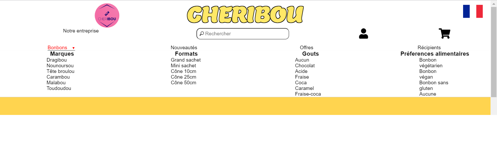
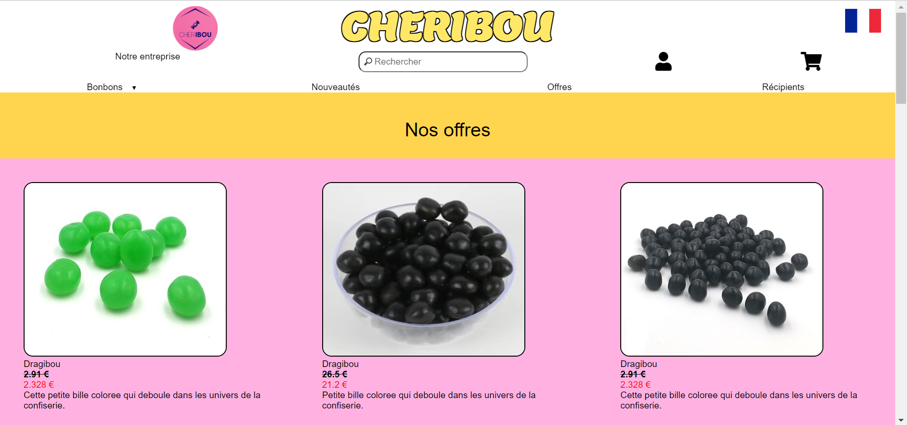
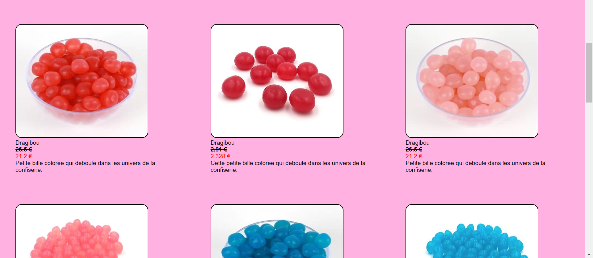

:toc:
:toc-placement!:
:toc-title: Table des matières
:toclevels: 6
:numbered:
:nofooter:

image::images/Logo.png[]
= CHERIBOU - Documentation destinée aux utilisateurs
_Réalisé par THOMPSON Victor, GUILLEVIC Yann, CABRILLAC Anthony, DOUVILLE Léo et HU Shiyu (1B)_

toc::[]

== Présentation générale du site web

Ce site web d'E-commerce a été réalisée lors de notre deuxième année de BUT informatique, nous avions pour but de réaliser un site web permettant de vendre le produits de notre client 'Cheribou' celle-ci nous permettra de simuler des actions que l’on peut retrouver dans une boutiques de ventes en lignes.

Le site web doit permettre la ventes des bonbons et autres produits proposé par notre client de dépôt. Les produits ainsi que les données personnelles des clients sont stockées dans une base de données. Le client devra pouvoir se connecter/créer un compte, visiter le catalogue des produits, ajouter un produit au panier et de valider son panier pour accèder au paiement. 

== Visite du site

Afin de pouvoir visiter le site, les clients devront posséder le lien permettant d'accéder : http://193.54.227.164/~SAESYS05/

== Fonctionnement du site d'E-commerce

Le site est destiné à 3 catégories d'utilosateurs. L'internaute ou visiteur, le client et l'administrateur.

=== Visiteur

Pour rappel, un visiteur a accès à toutes les fonctionnalités de base, que nous allons développer ci-après, et n'a pas accès au panier, à l'espace compte et au paiement.

===== Page sur l'entreprise 

En arrivant sur la page d'accueil, un visiteur aura accès à la page sur l'entreprise. Pour y accéder, il devra cliquer sur le menus ``Notre entreprise``.
Ceci vous redirigera vers la page suivante :

image::images/page_entreprise1.png[Page entreprise]
image::images/page_entreprise2.png[Page entreprise]
image::images/page_entreprise3.png[Page entreprise]

Cette page contient toute l'histoire de création de l'entreprise ainsi son besoin d'avoir un site d'e-commerce. NOus y avons également placé des chiffres clès comme sa date de création et son chiffre d'affaires.

===== Page sur les bonbons

Dans le header, en cliquant sur le menus ``Bonbons``, un menu déroulant apparaitra et vous pourrez choisir les types de bonbons que vous voulez accéder que ce soit par le marque, leur format, leur goût ou la préférence alimentaire.

Lorsque vous aurez cliqué sur un choix, vous serez redirigé vers la page d'affichage des bonbons comme suit : 

image::images/page_bonbon.png[Page bonbon]

En cliquant sur une image, le visiteur est redirigé vers la page de détail des bonbons. Il pourra voir différentes informations sur le produit, basculer de format quand s'est disponible, choisir sa quantité et ajouter au panier. 

Bien sur, le visiteur ne pourra pas ajouter un produit au panier, il devra d'abord se connecter ou créer un compte.

image::images/erreur_connexion.png[erreur]

===== Page sur les nouveautés

Toujours dans l'espace du menus en haut, le visiteur pourra cliquer sur le bouton ``Nouveautés``qui le redirigera vers la page des nouveaux produits.

image::images/page_nouveau.png[Page nouveau]

En ce moment, il y a 1 nouveau bonbon et 2 nouveaux récipients.

===== Page sur les offres

Le visiteur pourra aussi accéder à la page des produits en promotions en cliquant sur l'onglet ``Offres``. Dans cette page, le visiteur pourra donc voir les produits ayant un prix réduit. En ce moment, seul les bonbons _Dragibous_ sont en promotions avec une réduction de 20%.

===== Page contact

Un visiteur pourra envoyer des commentaires à l'entreprise via un formulaire de contact disponible soit sur la page de l'entreprise, via le bouton, soit dans le footer sur l'onglet ``contact``.

image::images/page_footer_contact.png[]

Après être parvenu sur la page, l'utilisateur sera invité à remplir tous les champs et a envoyé son message.

===== Page récipient

En cliquant sur l'onglet ``récipient`` dans le header, le visiteur sera redirigé vers la page des récipients. A partir d'ici, il pourra voir tous les récipients disponible à l'achat sur le site.

image::images/page_recipient1.png[]

image::images/page_recipient3.png[]

En cliquant sur une image, le visiteur est redirigé vers la page de détail des récipients où il pourra trouver plusieurs informations sur le produit ainsi que choisir sa quantité et ajouter au panier.

image::images/detailR.png[detailrecipient]

Bien sur, le visiteur ne pourra pas ajouter un produit au panier, il devra d'abord se connecter ou créer un compte.

image::images/erreur_connexion.png[erreur]

=== Client

Pour rappel, un client à la possibilité de réaliser toutes les fonctionnalités présentées ci-dessus avec en plus, l'accès au panier, à son espace compte et au paiement.

==== Connexion

===== Comment se connecter/créer un compte ? 

Voici la page d'accueil qui s'affichera lors de l'ouverture du site web depuis le lien donné précédemment.

Pour se connecter à son compte, le client devra appuyer sur l'icone "Compte" situé en haut à droite du menu de navigation :

image::images/compte.PNG[Icone Compte]

Le client aura alors la possibilité de se connecter ou bien de se créer un compte au cas écheant.

===== Identifiant et mot de passe

image::images/connexion.png[connexion]

Pour se connecter vous allez devoir saisir votre adresse mail ainsi que votre mot de passe crées lors de la création de votre compte. Si vous n'avez pas encore crée de compte vous devriez y renseigner votre nom, prénom, e-mail ainsi que le mot de passe que vous souhaitez utiliser.

____
- Votre e-mail renseigné doit être valide (contenant un '@') ;

- Votre mot de passe doit être valide (avoir au moins 8 caractères, dont une majuscules, une minuscule, un caractère spécial et un chiffres) ;

- l'e-mail ne peux pas etre dejà utilisé, auquel cas vous avez dejà un compte;

- Une fois vos champs non erronés saisis, il ne vous reste plus qu'à appuyer sur le bouton "Valider".
____

Si vos identifiants de connexion ne sont pas erronés, cela vous redirigera verts la page d'accueil.

image::/V0/images/log.png[Connexion à un compte]

===== Se déconnecter 

Pour vous déconnecter du compte, il vous suffira d'appuyer sur le bouton "Se déconnecter" en haut à droite dans la page "Compte".

image::/V0/images/gestionClient.png[Exercer le métier de guichetier]

==== Gestion de compte

===== Modifier les informations de votre compte

Vous vous êtes trompé lors de la création de votre ? Pas de problèmes, notre site web permet de rectifier d'éventuelles erreurs ! 
Afin de pouvoir modifier vos informations, il vous faut suffit de cliquer sur le bouton "Modifier" dans la rubrique "Informations personnelles" de la page Compte.

Prenons ici l'exemple du compte de Victor Thompson :

image::/V0/images/rechercheClient.png[Recherche Client]

Une fois le bouton "Modifier" cliqué, un formulaire permettant de changer vos informations apparaît.

===== Modifier son mot de passe

Pour modifier son mot de passe, un bouton "Modifier" dans la rubrique "Mot de passe" de la page compte est disponible. Malheureusement la fonctionnalité n'est pas encore implémentée.

image::/V1/images/cloturer1C.png[Etape 1 cloturer un compte]

===== Historiques de commandes

Une fois des commandes passées, vous pourrez les visualiser dans la rupriques "Historique de commandes" de la page compte

image::/V0/images/compte1.png[Etape 1 pour consulter compte]

=== Administrateur
