:toc:
:toc-placement!:
:toc-title: Table des matières
:toclevels: 6
:numbered:
:nofooter:

= CHERIBOU - Documentation destinée aux utilisateurs
_Réalisé par THOMPSON Victor, GUILLEVIC Yann, CABRILLAC Anthony, DOUVILLE Léo et HU Shiyu (1B)_

toc::[]

== Présentation générale du site web

Ce site web d'E-commerce a été réalisée lors de notre deuxième année de BUT informatique, nous avions pour but de réaliser un site web permettant de vendre le produits de notre client 'Cheribou' celle-ci nous permettra de simuler des actions que l’on peut retrouver dans une boutiques de ventes en lignes.

Le site web doit permettre la ventes des bonbons et autres produits proposé par notre client de dépôt. Les produits ainsi que les données personnelles des clients sont stockées dans une base de données. Le client devra pouvoir se connecter/créer un compte, visiter le catalogue des produits, ajouter un produit au panier et de valider son panier pour accèder au paiement. 

== Visite du site

Afin de pouvoir visiter le site, les clients devront posséder le lien permettant d'accéder : http://193.54.227.164/~SAESYS05/

== Fonctionnement du site d'E-commerce

Le site est destiné à 3 catégories d'utilosateurs. L'internaute ou visiteur, le client et l'administrateur.

=== Visiteur

Pour rappel, un visiteur a accès à toutes les fonctionnalités de base, que nous allons développer ci-après, et n'a pas accès au panier, à l'espace compte et au paiement.

===== Page sur l'entreprise 

image::images/page_accueil.png[Page d'accueil]

En arrivant sur la page d'accueil, un visiteur aura accès à la page sur l'entreprise. Pour y accéder, il devra cliquer sur le menus ``Notre entreprise``.
Ceci vous redirigera vers la page suivante :

Cette page contient toute l'histoire de création de l'entreprise ainsi son besoin d'avoir un site d'e-commerce. NOus y avons également placé des chiffres clès comme sa date de création et son chiffre d'affaires.

===== Page sur les bonbons

Dans le header, en cliquant sur le menus ``Bonbons``, un menu déroulant apparaitra et vous pourrez choisir les types de bonbons que vous voulez accéder que ce soit par le marque, leur format, leur goût ou la préférence alimentaire.

image::images/menus.png[menus]

Lorsque vous aurez cliqué sur un choix, vous serez redirigé vers la page d'affichage des bonbons comme suit : 

En cliquant sur une image, le visiteur est redirigé vers la page de détail des bonbons. Il pourra voir différentes informations sur le produit, basculer de format quand s'est disponible, choisir sa quantité et ajouter au panier. 

image::images/detailB.png[detailbonbon]

Bien sur, le visiteur ne pourra pas ajouter un produit au panier, il devra d'abord se connecter ou créer un compte.

===== Page sur les nouveautés

Toujours dans l'espace du menus en haut, le visiteur pourra cliquer sur le bouton ``Nouveautés``qui le redirigera vers la page des nouveaux produits.

En ce moment, il y a 1 nouveau bonbon et 2 nouveaux récipients.

===== Page sur les offres

Le visiteur pourra aussi accéder à la page des produits en promotions en cliquant sur l'onglet ``Offres``. Dans cette page, le visiteur pourra donc voir les produits ayant un prix réduit. En ce moment, seul les bonbons _Dragibous_ sont en promotions avec une réduction de 20%.

image::images/page_offre1.png[Page offre]
image::images/page_offre2.png[Page offre]

===== Page contact

Un visiteur pourra envoyer des commentaires à l'entreprise via un formulaire de contact disponible soit sur la page de l'entreprise, via le bouton, soit dans le footer sur l'onglet ``contact``.

Après être parvenu sur la page, l'utilisateur sera invité à remplir tous les champs et a envoyé son message.

image::images/page_contact.png[]

===== Page récipient

En cliquant sur l'onglet ``récipient`` dans le header, le visiteur sera redirigé vers la page des récipients. A partir d'ici, il pourra voir tous les récipients disponible à l'achat sur le site.

image::images/page_recipient2.png[]

En cliquant sur une image, le visiteur est redirigé vers la page de détail des récipients où il pourra trouver plusieurs informations sur le produit ainsi que choisir sa quantité et ajouter au panier.

Bien sur, le visiteur ne pourra pas ajouter un produit au panier, il devra d'abord se connecter ou créer un compte.

=== Client

Pour rappel, un client à la possibilité de réaliser toutes les fonctionnalités présentées ci-dessus avec en plus, l'accès au panier, à son espace compte et au paiement.

==== Connexion

===== Comment se connecter/créer un compte ? 

Voici la page d'accueil qui s'affichera lors de l'ouverture du site web depuis le lien donné précédemment.

image::images/page_accueil.png[Page d'accueil]

Pour se connecter à son compte, le client devra appuyer sur l'icone "Compte" situé en haut à droite du menu de navigation :

Le client aura alors la possibilité de se connecter ou bien de se créer un compte au cas écheant.

image::images/page_connexion.png[Page connexion]

===== Identifiant et mot de passe

Pour se connecter vous allez devoir saisir votre adresse mail ainsi que votre mot de passe crées lors de la création de votre compte. Si vous n'avez pas encore crée de compte vous devriez y renseigner votre nom, prénom, e-mail ainsi que le mot de passe que vous souhaitez utiliser. Bien sur, vous sereez aussi inviter a ccpeter les conditions d'utilisations

image::images/inscription.png[connexion]
____
- Votre e-mail renseigné doit être valide (contenant un '@') ;

- Votre mot de passe doit être valide (avoir au moins 8 caractères, dont une majuscules, une minuscule, un caractère spécial et un chiffres) ;

- L'e-mail ne peux pas etre dejà utilisé, auquel cas vous avez dejà un compte;

- Vous devez accepter les conditions d'utilisations

- Une fois vos champs non erronés saisis, il ne vous reste plus qu'à appuyer sur le bouton "Valider".
____

Si vos identifiants de connexion ne sont pas erronés, cela vous redirigera verts la page d'accueil.

===== Se déconnecter 

Après avoir créer un compte ou s'être connecté, un client arrivera sur la page d'information sur son compte en cliquant sur le logo du compte.

Pour vous déconnecter du compte, il vous suffira d'appuyer sur le bouton "Se déconnecter" en haut à droite dans la page "InfosCompte".

==== Gestion de compte

===== Modifier les informations de votre compte

En arrivant sur votre espace compte, vous aurez plusieurs choix. Tout d'abord, cet espace vous présente plusieurs informations sur votre compte comme votre nom, prénom, vos points de fidélités, votre numéro de téléphone et votre adresse mail. Vous pourrez modifier ces informations ainsi que votre mot de passe. PLus bas, vous aurez accès à l'historique de toutes vos commande passées sur le site.

Pour modifier vos informations, vous pouvez cliquer sur le bouton ``Modifier`` dans le carré de vos informations personnelles. Ainsi, un formulaire de modification apparaitra et vous pourrez remplir les champs.

Pour être valides, vos informations doivent respecter plusieurs formats.

____
- Votre nom et prénom de doit pas contenir de caractère spéciale ou de chiffres.

- Votre adresse mail doit être correctement écrite avec le format qui suit : lettre ou chiffre ou point suivie d'un @ puis lettre ou chiffre et si point, alors 4 caractères max pour .com par exemple.

- Enfin, le numéro de téléphone ne doit contenir que des chiffres de 0 à 9 avec 8 chiffres maximum.
____

Si les informations ne sont pas valides, des pop-up d'erreurs apparaitront. Sinon, vos informations seront bien modifiées.

===== Modifier son mot de passe

Pour modifier son mot de passe, un bouton "Modifier" dans la rubrique "Mot de passe" de la page compte est disponible. Vous serez redirigé vers un formulaire de modification.

===== Historiques de commandes

Une fois des commandes passées, vous pourrez les visualiser dans la rupriques "Historique de commandes" de la page compte

image::images/historique.png[historiquecommande]

===== Accéder à ses cadeaux (points de fidélités)

Dans votre espace compte, vous aurez la possibilité d'accès à vos cadeau lorsque vous avez des points de fidélités. Attention, vous devez avoir plus de 0 points pour que le bouton s'affiche. 

En cliquant sur le bouton ``voir mes cadeaux``, vous êtes rédirigé vers la page des cadeaux où vous pouvez payer certains articles avec des points de fidélités. Ceci seront donc "gratuit" dans votre panier. En fonction du nombre de point que vous avez, vous aurez la possibilité d'acheter différents produits (4 en tout) avec  25, 50, 100 ou 200 points.

==== Passer commande

===== Le panier

Lorsque vous créer un compte ou que vous réaliser votre première commande, vous n'avez pas de points de fidélités et aucun article dans le panier.

image::images/panier.png[panier]

Si vous ajouter un produit (bonbon ou récipient), celui-ci s'affichera dans le panier avec la quantité choisie, le prix unitaire et le prix total en fonction de la quantité. Aussi, les boutons en bas du panier changeront et vous pourrez le valider ou l'abandonner.

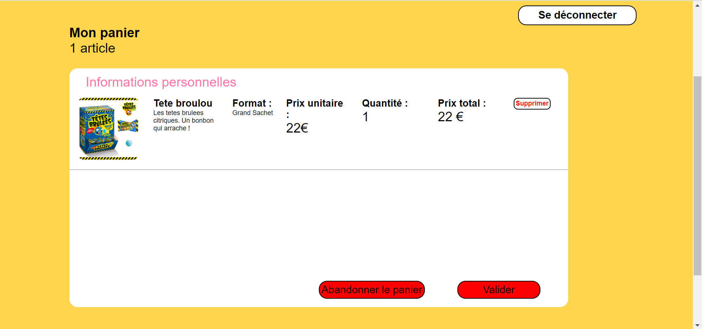

____
- Si vous cliquer sur le bouton ``supprimer``, à droite d'un produit, le la ligne entière sera supprimer de votre panier.

- Si vous cliquer sur bouton ``abandonner le panier``, tous les artciles seront supprimer et vous aurez un panier vide.

- Si vous validé, vous serez redirigé vers la page du paiement.
____

Si vous ajouté un produit, par exemple un bonbon, avec une quantité de 2 mais que vous voulez augmenter/réduire la quantité, alors au lieu que le même produit se s'affiche plusieurs fois, seulement la quantité et le prix total seront modifiés :

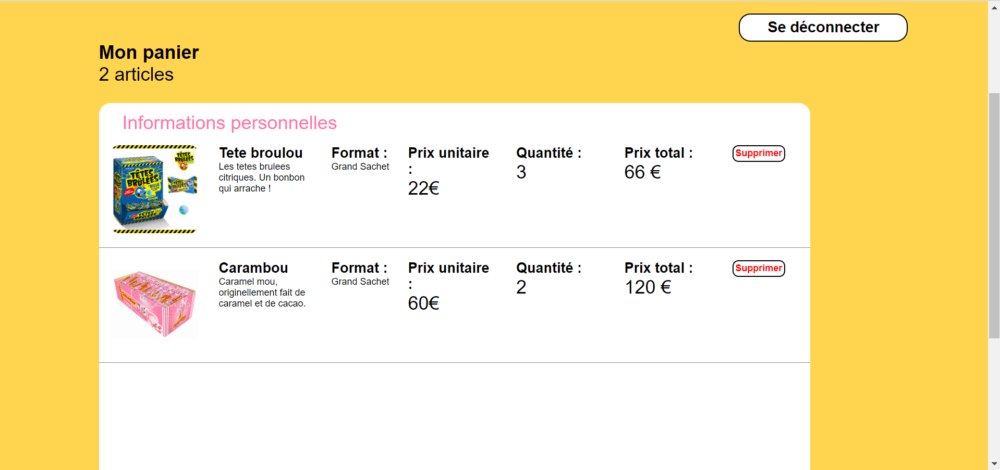
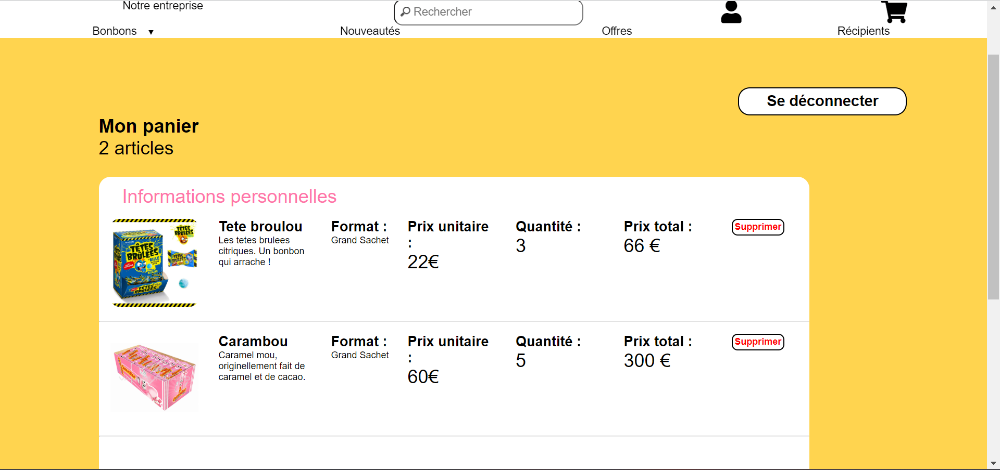

Ces tests marchent aussi pour les récipients.

Si vous acheté des produits avec vos points de fidélités, l'affichage dans le panier en sera modifié ainsi que le prix.

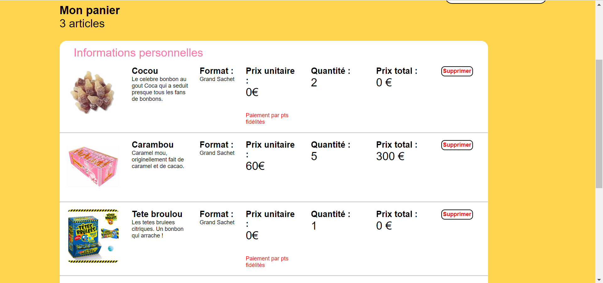

Dès que ces produits seront dans le panier, les points de fidélités sont retirés. Bien sur, si vous abandonner le panier ou supprimer le produit du panier, les points sont automatiquement recrédités sur votre compte.

===== Le paiement

Après avoir validé votre panier, vous serez redirigé vers la page du paiement, celle-ci vous invite à choisir votre mode de paiement (CB ou paypal) et vous pouvez également voir le récapitulatif de votre commande.

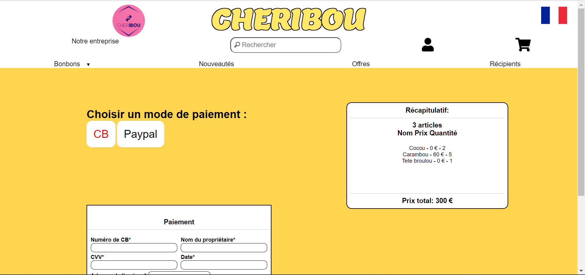
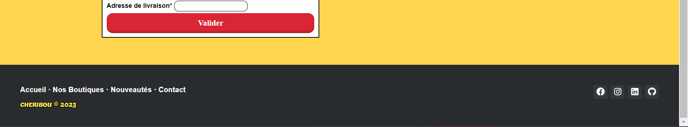

Vous pouvez basculer du paiement en CB au paiement paypal en cliquant sur les boutons ``CB`` et ``Paypal``.

Pour le formulaire du paiement en CB, pour être valides, vos informations doivent respecter plusieurs formats.

____
- Votre numéro de carte bleue doit contenir exclusivement 16 chiffres.

- Le nom du propriétaire commence par une majuscule et contient au maximum 15 caractères.

- Enfin, le CVV doit contenir 3 ou 4 chiffres.

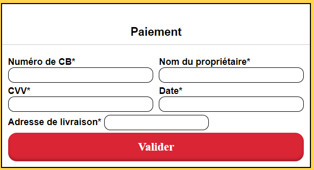
____

Pour le formulaire du paiement par paypal, pour être valides, vos informations doivent respecter plusieurs formats.
____
- Votre adresse mail doit être correctement écrite

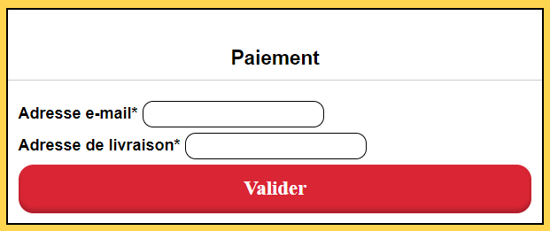
____

Lorsque vos informations sont correctement remplies, vous pouvez cliquez sur le bouton ``Valider`` qui vous ramènera sur votre panier (vide) et vous créditera des points de fidélités à hauteur de : prix de la commande divisé par 2.

=== Administrateur

L'esapce administrateur est un espace sécurisé, parallèle au site principal et qui n'est accessible que par un administrateur. Celui-ci a accès à 3 fonctionnalités principales.

===== Rajouter stock produit

Un administrateur peut rajouter du stock pour des bonbons ou des récipients en cliquant sur l'onglet ``Rajouter Stock``. Il lui suffit de sélectionner la catégorie (pour un bonbon) ou l'identifiant du récipient et de renseigner le nouveau stock. Une fois le bouton ``Valider`` appuyé, le stock sera modifié dans la base de donnée.

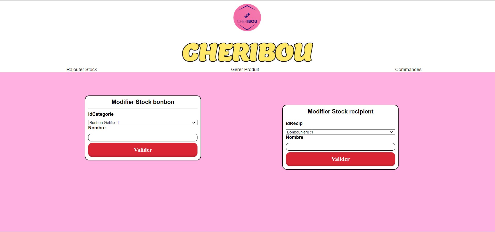

===== Gérer produit

En cliquant sur l'onglet ``Gérer produit``, un administrateur peut choisir s'il veut modifier un bonbon, un récipient ou une catégorie de bonbon.

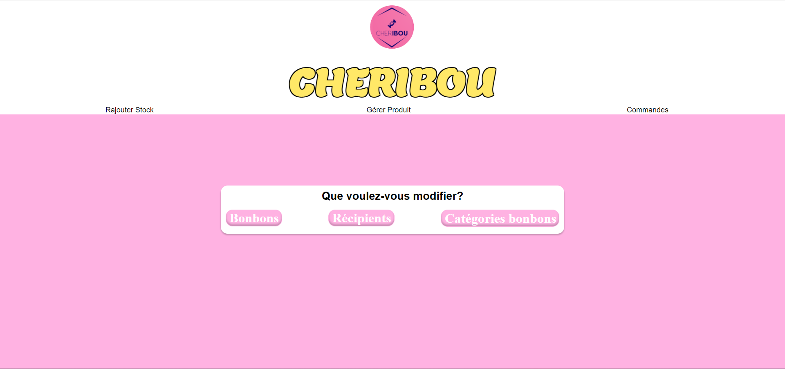

En cliquant sur 1 des 3 onglets qui sont apparus, l'administrateur pourra rajouter des bonbons, récipients ou catégorie et supprimer des bonbons, récipients ou catégories.

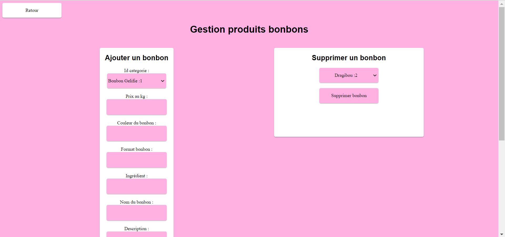

===== Voir commande client

En cliquant sur l'onglet ``Commandes``, un administrateur pourra visualiser les commandes réalisées par un client. Une liste déroulante lui permettra de sélectionner un id de client.

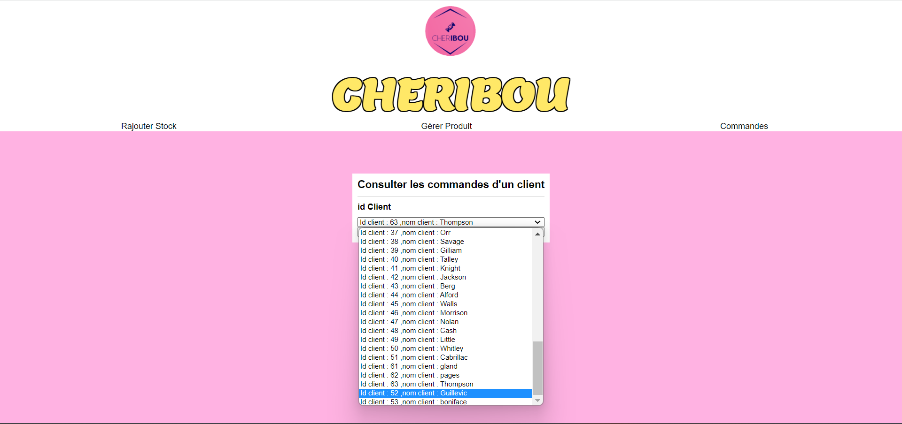

En cliquant sur le bouton ``Valider``, l'administrateur pourra voir toutes les commandes passées par le client qu'il a sélectionné.

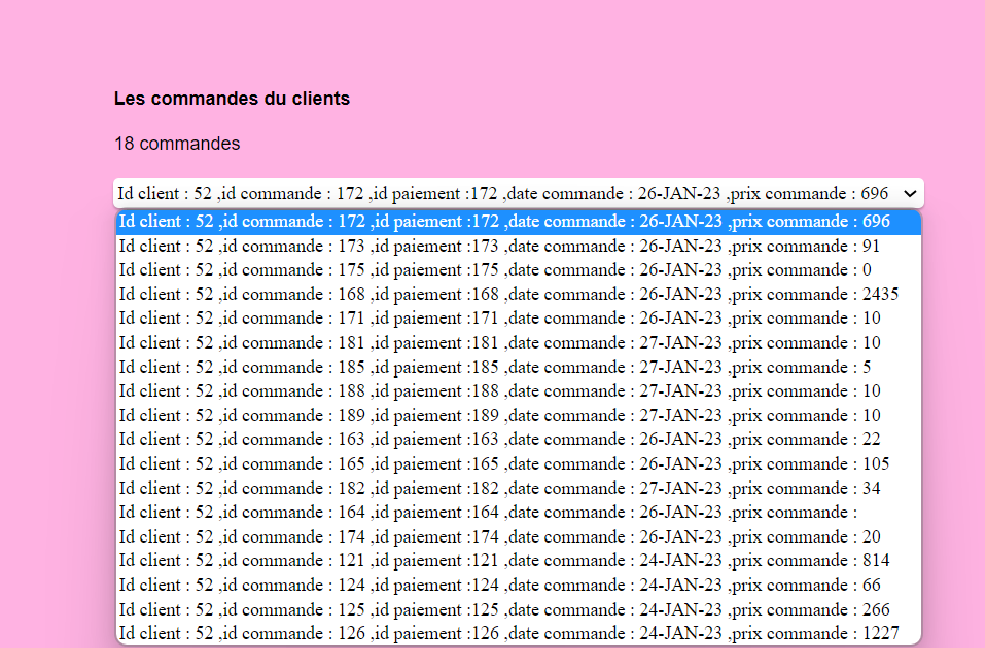

