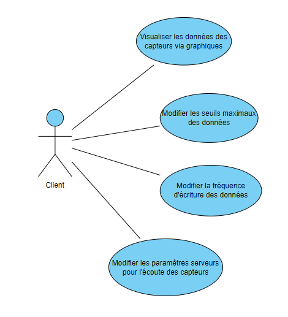
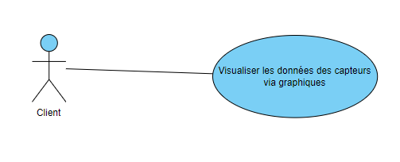
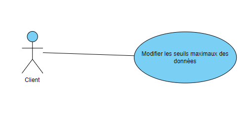
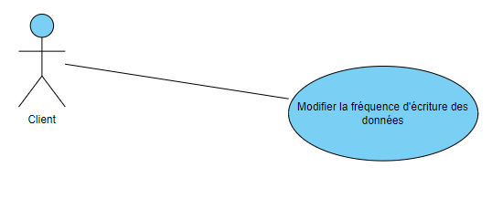
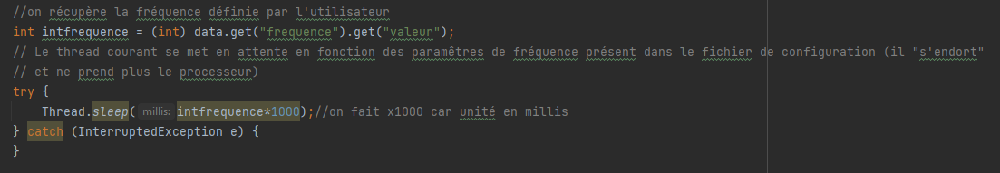
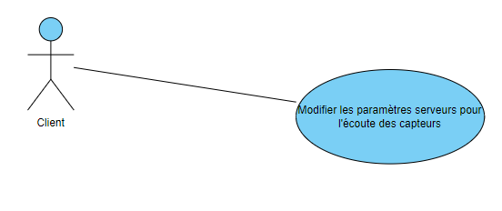
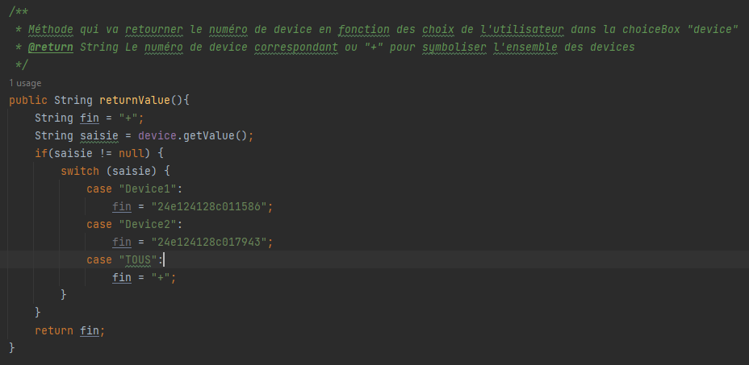

:toc:
:toc-placement!:
:toc-title: Table des matières

image::images/Logo.png[]
= Application JAVA - Documentation Technique 
_Réalisé par Anthony Cabrillac, Victor Thompson, Yann Guillevic, Léo Douville, Shiyu Hu_

toc::[]

== I - Présentation rapide de l'application
L’entreprise Cheribou souhaite suivre en direct l'environnement dans ses différents entreprôt de stockage. Plusieurs capteurs ont été installés permettant la récupération de données en CO2, température ainsi qu'humidité et souhaite disposer d'un outil permettant la visualisation de ces données pour s'assurer des bonnes conditions de stockage de ces produits (bonbons et récipients).

Ainsi, cette application permettra à notre client de visualiser les données des capteurs sur des graphiques et de modifier plusieurs paramêtres comme la gestion des seuils maximaux des données, la gestion de la fréquence d'émission et la gestion des serveurs choisis pour l'écoute.

=== 1. Explications du use case global

D'après ce Use Case, nous distinguons un utilisateur principale qui correspond à notre client, Cheribou.

Ils auront la spécifités de visualiser en direct l'évolution du taux de CO2, de la température et de l'humidité dans leur entrepôt.
Nos clients pourront également accéder à une page de modification des paramêtres de configuration des capteurs. Sur cette page, ils pourront :

- Modifier les seuils maximaux des données
- Modifier la fréquence d'écriture des données
- Modifier les paramêtres serveurs pour l'écoute des capteurs

== II - Architecture

=== 1. Architecture générale

Lorsqu'un client vient à utiliser l'application, celle-ci n'est en réalité pas complexe à son utilisation. Elle reste relativement claire, facile à comprendre et celle-ci possède une architecture relativement aisée à comprendre étant donné qu'elle est construite sur un fonctionnement centralisé.

L'application contient 3 parties globales. Premièrement, la partie générale de l'application qui respecte le pattern MVC, que nous verront en détail plus bas, et qui représente l'application avec les différentes fenêtres. 

Deuxièmement, nous stockons le fichier de donnée dans lequel le programme python y écris les données des capteurs. L'application y lis les données et les affiche dans les graphiques.

Troisèmement, le fichier de configuration en yml. Nous stockons également ce fichier car celui-ci est re-écris à chaque fois que le client modifiera des données comme il le souhaite.

==== 1.1 Poste client

Concrètement, cela se résume à ce que l'application puisse être utilisée de n'importe quel employé, depuis n'importe quel poste de travail. Le système de visualisation des données est basé sur une méthode permettant la mise à jour automatique des graphes suivant un délais pré-définis quelques sois l'utilisation ou la page sur laquelle se trouve le client.

=== 2. Ressources externes et rôles

L'application étant codée en Java, celle-ci aura pour extension de fichier, un ``.jar`` car ce format est avantageux pour stocker l'ensemble des définitions des classes ainsi que de ses métadonnées, constituant la totalité du programme.

Pour les employés souhaitant utiliser cette application pour visualiser les données, ils doivent s'assurer que leurs postes de travail soient équipés d'une ``JRE (Java Runtime Environement) 1.17``.

Concernant la librairie, l'application utilise la librairie jar.

=== 3. Structuration en packages de l'application

La structuration de l'application est répartie en plusieurs packages que voici : 

[source]
----
├── application
    │   ├── application.control
    │   ├── application.tools
    │   ├── application.view
    |   └── application.model
    └── resources
        └── ressources.python
----

=== 4. Éléments à connaître

Comme vous pouvez l'observer, le code de l'application est fourni dans 1 package principal étant ``application`` et dont celui-ci est constitué de 4 sous-packages principaux : +
____
• control ; 
• tools ; 
• view ; 
• model ; 
____

Ces packages font ainsi référence à un principe de structuration que l'application ici présente et que les applications web en règle générale utilisent : le principe de MVC (Model-View-Controller).

Le MVC (de son nom français _modèle-vue-contrôleur_) est le nom d'une méthodologie ou d'un motif de conception visant à faire le lien entre l'interface utilisateur et les modèles de données sous-jacents. Elle est notamment utile pour permettre de créer une application web afin de bien gérer la structuration d’un projet en trois parties ou encore pour la réutilisation du code objet, qui permet de réduire le temps nécessaire au développement d'applications dotées d'une interface utilisateur.

==== 4.1 Spécificités

Concernant le package ``application``, celui-ci constitue le package principal de l'application. 
Vous trouverez dans ce package (comme indiqué au dessus, à la partie _3. Structuration en packages de l'application_), quatre packages, dont les packages ``view``, ``control`` et ``model`` sont inclus dans l'acronyme MVC.
Concrètement : +
____
• Le sous-package _control_ comporte des classes permettant de faire communiquer les classes comprises dans le modèle ainsi que la vue. Ici, les classes présentes dans ce sous-package permettent d'afficher les différentes fenêtres ou sous-fenêtres de l'application.
• Le sous-package _tools_, comme son nom l'indique, est un sous-package d'outils. Celui-ci comporte des classes permettant de gérer certaines parties du code de l'application (notamment les alertes, la lecture de fichier et la mise en place du thread).
• Le sous-package _view_ comporte un ensemble de classes représentant les différents éléments présents dans l'interface utilisée par l'utilisateur (boutons, label, etc.) Ici-même, il contient l'ensemble des "controller" des différentes fenêtres ou sous-fenêtres avec leurs fichiers fxml respectifs.
• Le sous-package _model_ correspond à la partie "modèle" incluse dans l'acronyme MVC. Ce package permet de représenter la structure des données dans l'application logicielle mais également la classe supérieure qui y figure.
____

Au même niveau que le package ``Application``, nous avons également le package ``ressource`` qui contient la partie python avec fichier de configuration et fichier texte ainsi que le logo de l'entreprise Cheribou.
Concrètement : +
____
• Le sous-package _python_ contient essentiellement le main.py, c'est à dire, le programme principal python.
____

==== 4.2 Éléments nécessaires à la mise en oeuvre du développement

Pour une personne étant destiné à faire maintenir le fonctionnement de l'application, à réaliser de quelconques tests pour vérifier le fonctionnement de l'application ou tout simplement pour implémenter de nouvelles fonctionnalités, celle-ci devra obligatoirement opter pour une JRE (machine virtuelle Java) en version 1.8. 

Par la suite, il lui est nécessaire de posséder un IDE (environnement de développement intégré) pour tout simplement pouvoir observer le code et interagir avec. Eclipse ou encore IntelliJ IDEA sont des IDE que le développeur peut utiliser. 

Enfin, ce ne serait sans mentionner le Workspace depuis lequel repose l'application que le développeur pourrait programmer. Ce Workspace doit alors être configuré en JavaFX avec une version du JDK en 1.17. Le logiciel SceneBuilder devra être intégré dans le buildpath mais il est à préconiser afin d'interagir avec les fichiers fxml.

== III - Explications des fonctionnalités

=== 1. Affichage des données sous forme de graphique

Lors de son arrivé sur l'application, notre client pourra visualiser en temps réel les données en CO2, température et humidité via des labels mais aussi via des graphiques qui montreront l'évolution de ces données avec les différentes courbes. Cette implémentation est possible grâce à un thread.

===== Partie du use case conforme

===== Classes impliquées à l'implémentation de la fonction

Pour l'implémentation de cette action, plusieurs classes ont été impliquées :

*Côté ``Application.tools`` :* +
____
• _RunBackground.java_
• _ReadFile.java_
• _AlertUtilities.java_
____

*Côté ``Application.control`` :* +
____
• _MainFrame.java_
• _RunApp.java_
____

*Côté ``Application.view`` :* +
____
• _MainFrameController.java_
____

*Côté ``resources`` :* +
____
• _Config_yaml.yml_
• _mesures.txt_
____

===== Éléments à connaître / spécificités

Il y a plusieurs éléments à connaitre. Tout d'abord la classe ``RunBackground.java`` car c'est celle-ci qui contient la méthode que va exécuter le thread mais aussi la classe ``MainFrameController.java`` avec les 3 méthodes situées tout en bas _MajGraphesCO2()_, _MajGraphesHUM()_, _MajGraphesTEMP()_.

Ces 3 méthodes sont exécutés à chaque intervalle du thread.

Dans le package ``resources``, nous utilisons le fichier texte pour y récupérer les informations et les afficher dans les graphes.

===== Extraits de code commentés pour des points importants

Le code étant déjà présent dans l'application, il n'y a aucune partie qui mérite d'être signalée et venant de notre part.
De plus, il n'y a pas de détails spécifiques qui seraient difficiles à comprendre et donc à expliquer ou tout simplement d'être mentionné.

=== 2. Modifier les seuils maximaux des données

Lors de son arrivé sur l'application, notre client aura la possibilité de cliquer sur le bouton ``Configurer`` qui ouvrira une nouvelle fenêtre. 3 menus seront disponibles et le premier permet la modification des seuils maximaux pour chaque donnée (CO2, teméprature, humidité). Les 3 champs sont pré-remplis avec les données déjà présentes dans le fichier texte et l'utilisateur est libre de baisser ou monter ces valeurs. 

Lorsque le client a modifié les champs qu'il souhaite, il peut quitter cette fenêtre pour revenir sur la fenêtre principale et relancer l'application pour que les changements s'enregistrent.

===== Partie du use case conforme

===== Classes impliquées à l'implémentation de la fonction

Pour l'implémentation de cette action, plusieurs classes ont été impliquées :

*Côté ``Application.tools`` :* +
____
• _ReadFile.java_
____

*Côté ``Application.control`` :* +
____
• _MainFrame.java_
• _RunApp.java_
____

*Côté ``Application.view`` :* +
____
• _ConfigController.java_
____

*Côté ``Application.model`` :* +
____
• _ConfigData.java_
____

*Côté ``resources`` :* +
____
• _Config_yaml.yml_
• _mesures.txt_
____

===== Éléments à connaître / spécificités

Il y a un élement général à comprendre qui est la classe ``ConfigController.java`` qui contient les 2 méthodes permettant le pré-remplissage des champs de modification avec les valeurs déjà présente dans le fichier de configuration ainsi que la méthode pour la réécriture du fichier de configuration lors du changement des valeurs des champs.

Bien entendu, la classe ``ReadFile.java`` a également son importance puisque c'est celle-ci qui contient les méthodes qui vont extraire les données du  fichier de configuration.

===== Extraits de code commentés pour des points importants

Le code étant déjà présent dans l'application, il n'y a aucune partie qui mérite d'être signalée et venant de notre part.
De plus, il n'y a pas de détails spécifiques qui seraient difficiles à comprendre et donc à expliquer ou tout simplement d'être mentionné.

=== 3. Modifier les seuils maximaux des données

Lors de son arrivé sur l'application, notre client aura la possibilité de cliquer sur le bouton ``Configurer`` qui ouvrira une nouvelle fenêtre. 3 menus seront disponibles et deuxième correspond à la modification de la fréquence d'émission des données en seconde. 

Lorsque le client a modifié les champs qu'il souhaite, il peut quitter cette fenêtre pour revenir sur la fenêtre principale et relancer l'application pour que les changements s'enregistrent.

===== Partie du use case conforme

===== Classes impliquées à l'implémentation de la fonction

Pour l'implémentation de cette action, plusieurs classes ont été impliquées :

*Côté ``Application.tools`` :* +
____
• _ReadFile.java_
____

*Côté ``Application.control`` :* +
____
• _MainFrame.java_
• _RunApp.java_
____

*Côté ``Application.view`` :* +
____
• _ConfigController.java_
____

*Côté ``Application.model`` :* +
____
• _ConfigData.java_
____

*Côté ``resources`` :* +
____
• _Config_yaml.yml_
• _mesures.txt_
____

===== Éléments à connaître / spécificités

Comme dis précédemment, l'utilisateur peut donc modifier la fréquence d'émission des données. Cette modification correspond à 2 choses :

- De 1, elle correspond à la fréquence d'écriture que va respecter le programme python. Si la fréquence est de 15min, alors le programme écrira les nouvelles données dans le fichier texte toutes les 15min.

- De 2, elle correspond à la fréquence d'exécution du thread dans le programme JAVA. Dans la classe ``RunBackground.java``, la méthode _run()_ contient un try/catch dans lequel il faut renseigner la durée entre chaque rafraichissement par le thread en millisecondes.

Bien entendu, la classe ``ReadFile.java`` a également son importance puisque c'est celle-ci qui contient les méthodes qui vont extraire les données du  fichier de configuration.

===== Extraits de code commentés pour des points importants

Voici ci-dessus, notre catch contenant le temps d'endormissement du thread. Nous y implémentons la valeur de la fréquence choisis par l'utilisateur. Nous sommes contraint de multiplié par 1000 car le paramêtre est en millis et notre valeur est en seconde.

=== 4. Modifier les paramètres serveurs pour l'écoute des capteurs

Lors de son arrivé sur l'application, notre client aura la possibilité de cliquer sur le bouton ``Configurer`` qui ouvrira une nouvelle fenêtre. 3 menus seront disponibles et le premier permet le troisème contient 3 champs pré-remplis :

- Le nom du serveur
- Le numéro de port
- Le device correspondant

Le client peut a tout moment modifié ces données qui seront mise à jour se le fichier de configuration. Il faudra ainsi remdémarrer l'application.

Lorsque le client a modifié les champs qu'il souhaite, il peut quitter cette fenêtre pour revenir sur la fenêtre principale et relancer l'application pour que les changements s'enregistrent.

===== Partie du use case conforme

===== Classes impliquées à l'implémentation de la fonction

Pour l'implémentation de cette action, plusieurs classes ont été impliquées :

*Côté ``Application.tools`` :* +
____
• _ReadFile.java_
____

*Côté ``Application.control`` :* +
____
• _MainFrame.java_
• _RunApp.java_
____

*Côté ``Application.view`` :* +
____
• _ConfigController.java_
____

*Côté ``Application.model`` :* +
____
• _ConfigData.java_
____

*Côté ``resources`` :* +
____
• _Config_yaml.yml_
• _mesures.txt_
____

===== Éléments à connaître / spécificités

Il y a un élement général à comprendre qui est la classe ``ConfigController.java`` qui contient la méthode _returnValue()_. 

Explication : Sur notre fxml, le client pourra choisir le device qu'il souhaite via un choiceBox. Dans cette choiceBox, le client à 3 choix possible. Le device1, le device2 ou "TOUS" qui signifie que le programme python va s'abonner à tout les capteurs.

Cependant, dans notre champs "device" dans le fichier de configuration, nous ne pouvons pas rentrer les valeurs "device1" ou "device2". Nous avons donc écris une méthode, _returnValue()_, qui va, pour chaque choix, retourner un String qui correspond au numéro du device. L'exception est pour le choix "TOUS" pour lequel nous renvoyons "+".

Nous intégrons ensuite la valeur retourner dans notre fichier de configuration.

Bien entendu, la classe ``ReadFile.java`` a également son importance puisque c'est celle-ci qui contient les méthodes qui vont extraire les données du  fichier de configuration.

===== Extraits de code commentés pour des points importants

Comme expliqué ci-dessus, cette méthode va retourner un code correspondant au différend device, que nous incorporons dans le fichier de configuration. 

== IV - Procédure d'installation

Sur notre dépot github ou dans les fichiers sources fournis, vous trouverez 2 projets distincts.

=== 1. Installation environnement JAVA

Le premier, nommé ``SAE_JavaFX``, contient le programme JAVA. 

Vous pouvez télécharger ce dossier et l'ouvrir sur IntelliJ par exemple. Une fois ouvert, il est possible qu'une erreur apparaisse vous signalant que le projet est _out of source root_. Pour résoudre cela, vous devez aller en haut à gauche dans le menu ``File``, puis dans ``Project Structures``. Vous sélectionnez l'onglet ``Modules`` et là l'arborescence du projet apparait. Vous pouvez cliquer sur ``src`` puis ``Applciation``, qui vient d'apparaitre, puis sur l'onglet ``Sources`` en bleu, un peu plus haut puis cliquez sur ``Apply``.

A ce moment là, il vous suffie de patienter un peu et les problêmes devraient se résoudre.

Au niveau du JDK, assurez-vous d'avoir une version de JAVA compatible avec java 17.

=== 2. Installation environnement python

Le deuxième, nommé ``SAE_Python``, contient le programme python.

Celui-ci est différent de l'autre car nous avons dû modifier la gestion de la fréquence étant donné que SIGARLM n'existe pas sur Windows. Au niveau du reste, son fonctionnement est identique.

Vous pouvez téléchargé ce dossier est l'ouvrir sur PyCharm, par exemple. Une fois ouvert 2 cas peuvent survenir. Le premier est que vous n'avez pas d'erreur de compilation et le deuxième est que vous avez bien des erreurs de compilation.

- Pour le premier cas. Vous n'avez pas d'erreur de compilation. Dans ce cas, il vous faudra seulement modifier les chemins d'accès au fichier de configuration et au fichier texte présent dans le projet JAVA dans le package ``resources``. Une première fois dans la méthode _ecriture()_ et une deuxième fois, juste en dessous, lors de l'ouverture du fichier de configuration.

- Dans le deuxième cas, vous avez des erreurs pour l'importation yml et paho. Normalement, nous avons déjà créé un environnement virtuel contenant ces librairies mais il nous est déjà arrivé que l'environnement ne marche pas lors de l'ouverture sur une nouvelle machine.

Cependant, pour ce faire c'est très simple. Sur PyCharm, vous devez allé en haut à gauche dans le menu ``File`` puis dans ``settings``. Une page s'ouvre et, à gauche, vous pouvez cliquer sur le menu ``Project: SAE_Python`` puis sur ``Project interpreter``.

Vous pouvez ajouter un nouvel interpreter via votre machine avec le path menant vers votre executable python : python.exe.
Ainsi, après avoir ajouter votre interpreter, vous pouvez cliquer sur le ``+`` à gauche dans la page et installer 2 paquets :

- Le paquet PyYAML pour interpréter le yml du fichier de configuration.
- Le paquet paho-mqtt pour interpréter la connexion au broker mqtt.

Après, que les paquets aient été installés et que les 2 chemins d'accès aux fichiers pointent bien aux bons fichiers dans le programme JAVA, votre environnement est prêt.

